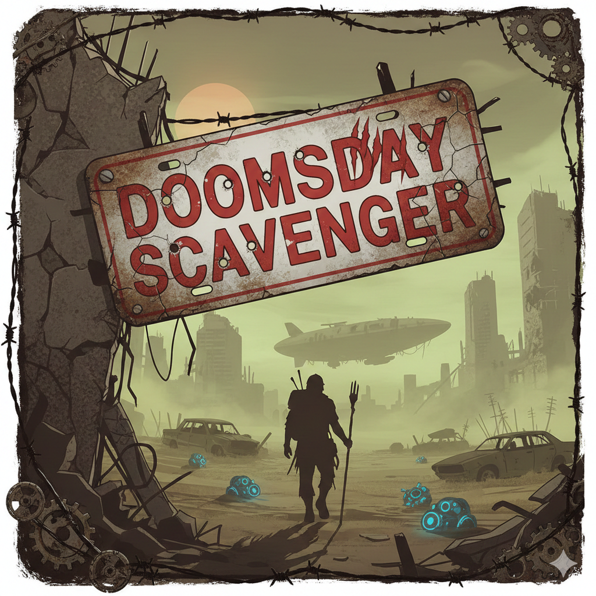
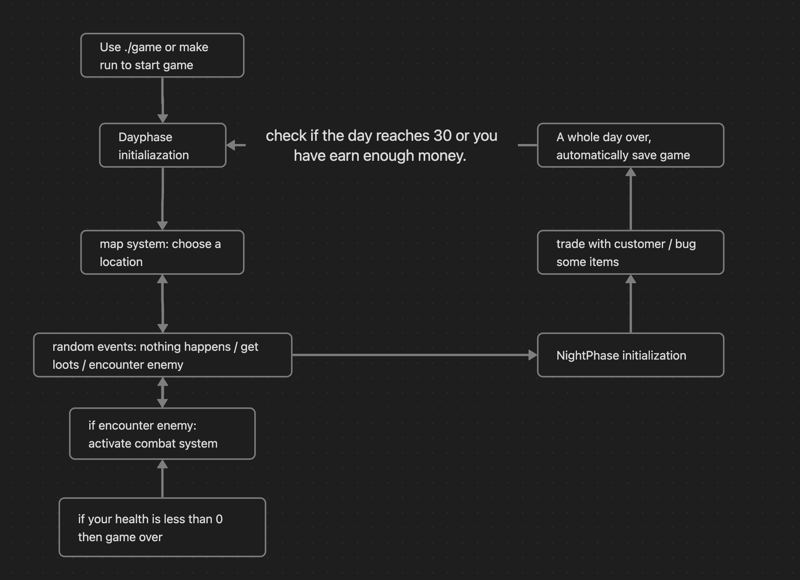

# Doomsday Scavenger

## Description

In this game, you will be a magic bard who tries to survive in the end times. All you have is a flute that can play beautiful music and a backpack. During the day phase, you can explore and scavenge. During the night phase, you can trade and transact.

---

## Team members

Lang Ruifan

Luo Jian

Peng Yicheng

Sun Jiawei

Tian Congxi

Zhang Wenyi

---

## Part 1: How to Compile & Run

### **Environment**
- **Operating System:** Linux/Unix systems (macOS, Linux)
- **Compiler:** Any C++ compiler that supports C++11 or higher (e.g., `g++`, `clang++`)
- **Dependencies:** None (fully implemented with standard C++ libraries)

### **Compilation Steps**

1. **Clone or download the project**
   ```bash
   git clone https://github.com/Erber102/HKU-COMP2113-GP.git
   cd HKU-COMP2113-GP
   ```

2. **Compile the game using Makefile**
   ```bash
   make
   ```

3. **Run the game**
   ```bash
   make run
   ```
   or
   ```bash
   ./bin/game
   ```

4. **Clean build files (optional)**
   ```bash
   make clean
   ```

### **Manual Compilation**
If you prefer to compile manually:
```bash
g++ -Wall -Wextra -std=c++11 -Isrc/Core -Isrc/Player -Isrc/Map -Isrc/Combat -Isrc/Night -Isrc/Item -Isrc/Save \
    src/Core/main.cpp src/Core/Game.cpp src/Player/Player.cpp src/Core/InputSystem.cpp src/Core/UISystem.cpp \
    src/Item/item.cpp src/Item/itemdatabase.cpp src/Item/backpack.cpp src/Save/SaveSystem.cpp src/Core/panel.cpp \
    src/Map/DayPhase.cpp src/Map/Event.cpp src/Map/Map.cpp src/Night/Customer.cpp src/Night/Market.cpp \
    src/Night/NightPhase.cpp src/Combat/CombatPlayer.cpp src/Combat/combat.cpp src/Combat/enemy.cpp \
    src/Combat/character.cpp src/Combat/utils.cpp -o bin/game
```

---

## Part 2: Game Flow Chart



The game follows a structured daily cycle:
1. **Main Menu** - Start new game, load saved game, or test combat
2. **Day Phase** - Explore locations, find resources, encounter events
3. **Combat Phase** - Fight enemies using musical notes and runes
4. **Night Phase** - Trade with customers, access black market
5. **Save/Load** - Persist game progress between sessions

---

## Part 3: Features List

### **Core Game Systems**
- **Day/Night Cycle:** Structured gameplay with distinct day and night phases
- **Exploration System:** Discover locations with varying danger levels
- **Combat System:** Turn-based combat using musical notes and rune combinations
- **Trading System:** Buy and sell items during night phase
- **Inventory Management:** Backpack system with item usage capabilities

### **Technical Features**
- **Random Events:** Dynamic event system during exploration (resources, enemies, discoveries)
- **Data Structures:** Structs for player data, items, customers; vectors for inventory management
- **Dynamic Memory Management:** Proper use of `new` and `delete` for item objects
- **File Input/Output:** Save and load game progress to `savegame.dat`
- **Modular Design:** Separate header and implementation files for each system
- **Multiple Difficulty Levels:** Easy, Normal, and Hard modes affecting gameplay balance

### **User Interface**
- **Interactive Menus:** Clear navigation through game phases
- **Real-time Combat:** Musical note input system with visual feedback
- **Backpack Access:** View and use items during both combat and exploration
- **Status Display:** Health, stamina, money, and inventory tracking

---

## Part 4: Member Contributions

### **Lang Ruifan: Item/Backpack System** (`./src/Item/`)
- Implemented item data structures and properties
- Developed backpack system for inventory management
- Created item usage mechanics with health and stamina effects
- Integrated backpack functionality into combat and exploration phases

### **Luo Jian: Combat System** (`./src/Combat/`)
- Designed and implemented turn-based combat mechanics
- Created musical note system with 7 different effects
- Developed rune combinations for powerful special abilities
- Implemented enemy AI and combat progression

### **Peng Yicheng: Map System and Events** (`./src/Map/`)
- Built location-based exploration system
- Implemented random event generation
- Created danger level mechanics for different locations
- Developed event result handling and loot distribution

### **Sun Jiawei: Night Phase** (`./src/Night/`)
- Designed customer interaction system
- Implemented market mechanics and pricing
- Created black market functionality
- Developed end-of-night processing and resource management

### **Tian Congxi: Main Program and Player Management** (`./src/Core/`, `./src/Player/`)
- Developed main game loop and state management
- Implemented player character system with stats and inventory
- Created UI system and input handling
- Integrated all game systems into cohesive experience

### **Zhang Wenyi: Save and Load System** (`./src/Save/`)
- Implemented game state serialization
- Created save file management (`savegame.dat`)
- Developed load game functionality
- Ensured data persistence across game sessions

---

## How to Play

1. **Start the Game:**
   - Launch the game and choose your difficulty level (**Easy**, **Normal**, or **Hard**)
   - The game starts at Day 1, with each day divided into day and night phases

2. **Combat Controls:**
   - Use number keys **1-7** to play musical notes with different effects
   - Combine notes to form powerful runes for enhanced abilities
   - Press **B** during combat to access your backpack and use items

3. **Exploration:**
   - Select locations to explore during the day phase
   - Encounter random events including resources, enemies, and discoveries
   - Press **99** during location selection to check your backpack

4. **Trading:**
   - Interact with customers during the night phase
   - Buy and sell items to manage your resources
   - Access the black market for special items

---

## Project Structure

```
.
├── src/
│   ├── Core/
│   │   ├── main.cpp
│   │   ├── Game.cpp/.h
│   │   ├── InputSystem.cpp/.h
│   │   ├── UISystem.cpp/.h
│   │   └── panel.cpp/.h
│   ├── Player/
│   │   └── Player.cpp/.h
│   ├── Item/
│   │   ├── item.cpp/.h
│   │   ├── itemdatabase.cpp/.h
│   │   └── backpack.cpp/.h
│   ├── Save/
│   │   └── SaveSystem.cpp/.h
│   ├── Map/
│   │   ├── DayPhase.cpp/.h
│   │   ├── Event.cpp/.h
│   │   └── Map.cpp/.h
│   ├── Night/
│   │   ├── Customer.cpp/.h
│   │   ├── Market.cpp/.h
│   │   └── NightPhase.cpp/.h
│   └── Combat/
│       ├── CombatPlayer.cpp/.h
│       ├── combat.cpp/.h
│       ├── enemy.cpp/.h
│       ├── character.cpp/.h
│       └── utils.cpp/.h
├── bin/ (executable output)
├── build/ (compiled objects)
└── Makefile
```

